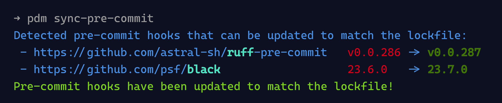

# sync-pre-commit-lock

[](https://github.com/GabDug/sync-pre-commit-lock/actions/workflows/ci.yml)
[](https://results.pre-commit.ci/latest/github/GabDug/sync-pre-commit-lock/main)
[](https://bestpractices.coreinfrastructure.org/projects/7529)
[](https://pypi.org/project/sync-pre-commit-lock/)
[](https://pypi.python.org/pypi/sync-pre-commit-lock)
[](https://pypi.python.org/pypi/sync-pre-commit-lock)
[](https://pdm.fming.dev)
[](https://github.com/charliermarsh/ruff)

PDM and Poetry plugin to sync your pre-commit versions with your lockfile and automatically install pre-commit hooks.



## Features

- 🔁 Sync pre-commit versions (including `additional_dependencies`) with your lockfile
- ⏩ Run every time you run the lockfile is updated, not as a pre-commit hook
- 🔄 Install pre-commit hooks automatically, no need to run `pre-commit install` manually
- 💫 Preserve your pre-commit config file formatting
- 🍃 Lightweight, only depends on [strictyaml](https://pypi.org/project/strictyaml/) and [packaging](https://pypi.org/project/packaging/)

## Supported versions

- Python 3.9+
- PDM 2.7.4+
- Poetry 1.6.0+

## Installation

### For PDM

Install it [just like any other PDM plugin](https://pdm.fming.dev/latest/dev/write/#activate-the-plugin):

```bash
pdm self add "sync-pre-commit-lock"
```

Optionally, you can also specify [the plugin in your project](https://pdm.fming.dev/latest/dev/write/#specify-the-plugins-in-project) `pyproject.toml`, to make it installable with `pdm install --plugins`:

```toml
[tool.pdm]
plugins = [
    "sync-pre-commit-lock"
]
```

> Note: we have an extra group `[pdm]`, that adds PDM version constraints.
> While it's safer, it might result in PDM being installed twice.

### For Poetry

Install [like any other Poetry plugin](https://python-poetry.org/docs/master/plugins/#using-plugins), e.g.:

```bash
poetry self plugin add "sync-pre-commit-lock[poetry]"
```

> Only Poetry 1.6.0+ is supported.

## Configuration

This plugin is configured using the `tool.sync-pre-commit-lock` section in your `pyproject.toml` file.

Here is the default configuration:

```toml
[tool.sync-pre-commit-lock]
# Run `pre-commit install` automatically if applicable
automaticall-install-hooks = true
# Should we sync your pre-commit versions with your lockfile (when running lock, add, update, remove, etc.)?
disable-sync-from-lock = false
# Packages to ignore when syncing from lock
ignore = []
# Name of the pre-commit config file to sync with
pre-commit-config-file = ".pre-commit-config.yaml"
# Additional mapping of URLs to python packages
# Default is empty, but will merge with the default mapping
# "rev" indicates the format of the Git tags
dependency-mapping = {"package-name"= {"repo"= "https://github.com/example/package-name", "rev"= "v${rev}"}}
```

> Note: the `dependency-mapping` is merged with the default mapping, so you don't need to specify the default mapping if you want to add a new mapping.
> Repos urls will be normalized to http(s), with the trailing slash removed.

### From environment

Some settings are overridable by environment variables with the following `SYNC_PRE_COMMIT_LOCK_*` prefixed environment variables:

| `toml` setting                | environment                            | format                            |
| ------------------------------|----------------------------------------|-----------------------------------|
| `automatically-install-hooks` | `SYNC_PRE_COMMIT_LOCK_INSTALL`         | `bool` as string (`true`, `1`...) |
| `disable-sync-from-lock`      | `SYNC_PRE_COMMIT_LOCK_DISABLED`        | `bool` as string (`true`, `1`...) |
| `ignore`                      | `SYNC_PRE_COMMIT_LOCK_IGNORE`          | comma-separated list              |
| `pre-commit-config-file`      | `SYNC_PRE_COMMIT_LOCK_PRE_COMMIT_FILE` | `str`                             |

## Usage

Once installed, and optionally configured, the plugin usage should be transparent, and trigger when you run applicable PDM or Poetry commands, like `pdm lock`, or `poetry lock`.

> There should be a message in the output, when the sync or install or pre-commit is triggered.

You can manually trigger the sync with the CLI command:

```bash
pdm sync-pre-commit
```

or

```bash
poetry sync-pre-commit
```

Both commands support `--dry-run` and verbosity options.

## Supported packages for pre-commits

Here is the list of default packages supported by this plugin, from [`db.py`](https://github.com/GabDug/sync-pre-commit-lock/blob/main/src/sync_pre_commit_lock/db.py). You can add more packages using the `dependency-mapping` configuration.

<!-- GENERATED-PACKAGES-LIST -->
<!-- @generated by scripts/db_md.py -->
- [autopep8](https://github.com/hhatto/autopep8)
- [bandit](https://github.com/PyCQA/bandit)
- [black](https://github.com/psf/black-pre-commit-mirror)
- [check-jsonschema](https://github.com/python-jsonschema/check-jsonschema)
- [codespell](https://github.com/codespell-project/codespell)
- [commitizen](https://github.com/commitizen-tools/commitizen)
- [djhtml](https://github.com/rtts/djhtml)
- [docformatter](https://github.com/PyCQA/docformatter)
- [flake8](https://github.com/pycqa/flake8)
- [flakeheaven](https://github.com/flakeheaven/flakeheaven)
- [isort](https://github.com/pycqa/isort)
- [mypy](https://github.com/pre-commit/mirrors-mypy)
- [pdm](https://github.com/pdm-project/pdm)
- [poetry](https://github.com/python-poetry/poetry)
- [pycln](https://github.com/hadialqattan/pycln)
- [pyroma](https://github.com/regebro/pyroma)
- [pyupgrade](https://github.com/asottile/pyupgrade)
- [rtscheck](https://github.com/rstcheck/rstcheck)
- [ruff](https://github.com/astral-sh/ruff-pre-commit)
- [yamllint](https://github.com/adrienverge/yamllint)
<!-- END-GENERATED-PACKAGES-LIST -->

> Note: `pdm` or `poetry` version will be added, from the current instance version, and not from the lockfile.

## Improvement ideas

Feel free to open an issue or a PR if you have any idea, or if you want to help!

### Release / CI / DX

- [ ] Add a changelog
- [ ] Add "E2E" tests
- [ ] Add docs

### Features or fixes

- [X] Support hooks URL aliases for the same Python package
  - [ ] Support user configuration of aliases
- [ ] Support `pdm config` and clear configuration precedence
- [ ] Create a more verbose command
- [ ] Add support for other lockfiles / project managers (pipenv, flit, hatch, etc.)
- [ ] Expose a pre-commit hook to sync the lockfile
- [x] Support nested `additional_dependencies`, (ie. mypy types)
- [ ] Support reading DB from a Python module?
- [ ] Support reordering DB inputs (file/global config/python module/cli)?
- [ ] Test using SSH/file dependencies?
- [ ] Check ref existence before writing?
- [ ] New feature to convert from pre-commit online to local?
- [ ] Warning if pre-commit CI auto update is also set?
- [ ] Support automatic repository URL update (from legacy aliased repositories)


## Inspiration

This project is inspired by @floatingpurr's [sync_with_pdm](https://github.com/floatingpurr/sync_with_pdm/) and [sync_with_poetry](https://github.com/floatingpurr/sync_with_poetry/).

The code to install pre-commit hooks automatically is **adapted** from @vstrimaitis's [poetry-pre-commit-plugin](https://github.com/vstrimaitis/poetry-pre-commit-plugin/), licensed under GPL-3.
